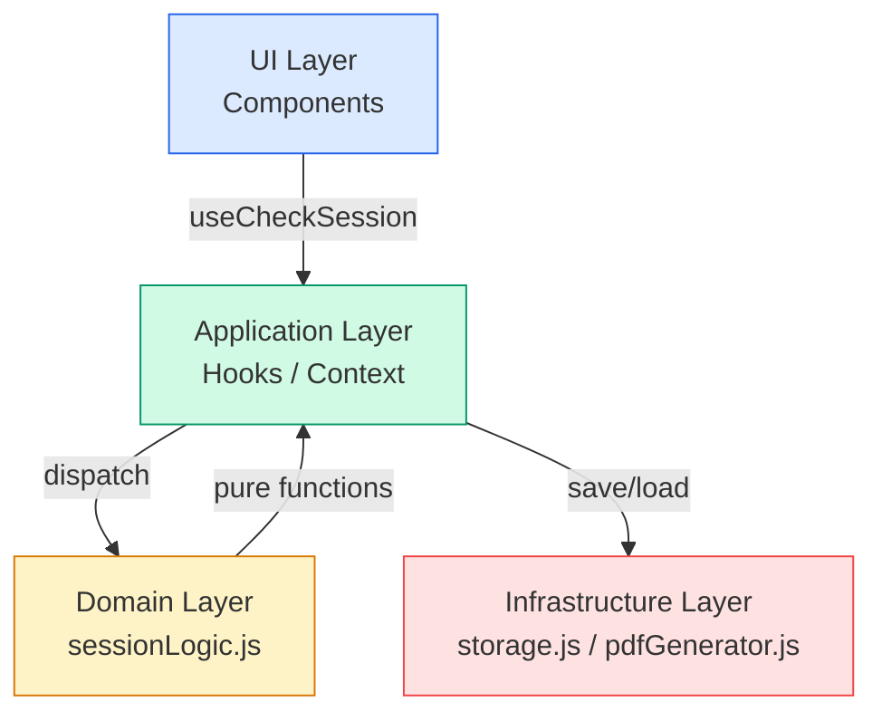

# 🏗️ CheckSheet アーキテクチャレビュー

> **レビュー日**: 2026-04-10  
> **対象**: 測量前チェックシステム (CheckSheet PWA)  
> **レビュアー**: シニアソフトウェアアーキテクト

---

## 1. 全体評価（5段階）

| 観点 | 評価 | コメント |
|---|:---:|---|
| **アーキテクチャ健全性** | ⭐⭐⭐⭐☆ (4/5) | Context + useReducer による状態管理、domain 層分離など基本設計は良好。ルーティングが自前の文字列比較で脆弱 |
| **保守性** | ⭐⭐⭐☆☆ (3/5) | CSS が 1,360 行の単一ファイル。インラインスタイル混在。コンポーネント内でのロジック混在あり |
| **拡張性** | ⭐⭐⭐☆☆ (3/5) | チェック項目数「39」のハードコードが複数箇所に散在。新カテゴリ追加時に手動修正が必要 |
| **安定性** | ⭐⭐⭐☆☆ (3/5) | PDF 生成のエラーハンドリングが alert のみ。セッション整合性のバリデーション不足 |

---

## 2. 重大問題（優先度：高）

### 🔴 H-1: チェック項目数のハードコード（データ不整合リスク）

**場所**: [HomeScreen.jsx:34](file:///c:/Users/t-matsuki/Desktop/CheckSheet/src/components/HomeScreen.jsx#L34)

```jsx
// HomeScreen.jsx L34
進捗: {resumeSession.answers.length}/43項目
```

**問題**: `checkItems.js` では `TOTAL_ITEMS` を動的に計算しているにも関わらず、HomeScreen では `43` がハードコードされている。現在の実データは **39項目**（6カテゴリ）なので、すでに表示が不正確。カテゴリの追加・削除時に必ずバグになる。

**リスク**: ユーザーに誤った進捗情報が表示され、フィールドでの信頼性を損なう。

**改善案**:
```jsx
import { TOTAL_ITEMS } from "../data/checkItems";
// ...
進捗: {resumeSession.answers.length}/{TOTAL_ITEMS}項目
```

---

### 🔴 H-2: 結果画面の回答修正→チェック画面遷移で `goToIndex` が呼ばれない

**場所**: [App.jsx:71-74](file:///c:/Users/t-matsuki/Desktop/CheckSheet/src/App.jsx#L71-L74), [ResultScreen.jsx:114](file:///c:/Users/t-matsuki/Desktop/CheckSheet/src/components/ResultScreen.jsx#L114)

```jsx
// App.jsx
const handleEditFromResult = (editIndex) => {
  setScreen("check");  // ← goToIndex が呼ばれていない
  logger.debug("Returning to check screen for edit", { index: editIndex });
};
```

```jsx
// ResultScreen.jsx L114
onClick={() => onEdit(session.answers.findIndex(a => a.itemId === item.id))}
```

**問題**: `handleEditFromResult` が `editIndex` を受け取るが、それをセッションの `currentIndex` に反映していない。結果画面で修正したい項目をタップしても、チェック画面に戻った時に最後に回答した質問が表示されてしまう。

また、`findIndex` の結果が `-1` になる可能性（答えが見つからないケース）のガードもない。

**リスク**: ユーザーが意図した質問を修正できず、操作に混乱が生じる。

**改善案**:
```jsx
const handleEditFromResult = (editIndex) => {
  if (editIndex >= 0) {
    // answers配列のインデックスではなく、allItems配列上のインデックスに変換する必要がある
    const allItems = getAllItems();
    const answer = session.answers[editIndex];
    const itemIndex = allItems.findIndex(item => item.id === answer?.itemId);
    if (itemIndex >= 0) {
      goToIndex(itemIndex);
    }
  }
  setScreen("check");
};
```

---

### 🔴 H-3: `isSessionCompleted` の判定ロジックが不正確

**場所**: [sessionLogic.js:48-49](file:///c:/Users/t-matsuki/Desktop/CheckSheet/src/domain/sessionLogic.js#L48-L49)

```js
export function isSessionCompleted(answers, totalItems) {
  return answers.length === totalItems;
}
```

**問題**: `answers.length` だけで完了判定しているが、`updateAnswersList` は既存回答を上書きする仕組みなので `answers.length` は増えない場合がある。全項目に回答したかを確認するには、**ユニークな項目ID数**で判定すべき。

**リスク**: 回答を修正した後に完了状態が解除されない、または同じ項目に2回回答すると未回答の項目があっても完了と判定される可能性がある。

**改善案**:
```js
export function isSessionCompleted(answers, totalItems) {
  const uniqueItemIds = new Set(answers.map(a => a.itemId));
  return uniqueItemIds.size >= totalItems;
}
```

---

### 🔴 H-4: PDF 生成時のユーザーフィードバックが `alert()` のみ

**場所**: [pdfGenerator.js:61](file:///c:/Users/t-matsuki/Desktop/CheckSheet/src/utils/pdfGenerator.js#L61)

```js
alert("PDF出力に失敗しました。もう一度お試しください。");
```

**問題**: ユーティリティ関数内で `alert()` を直接呼んでおり、UI 層の責務が Infrastructure 層に漏れている。テスト不可能で、将来的に通知方式を変更する際に修正が困難。

**リスク**: ユーザー体験の一貫性が保てない。テスタビリティの低下。

**改善案**: 例外をスローまたはエラーオブジェクトを返し、UI 層で適切にハンドリングする。
```js
// pdfGenerator.js
export async function generatePDF(element, sessionData) {
  // alert() を削除し、エラーを throw する
  // ...
  throw new Error("PDF生成に失敗しました");
}

// ResultScreen.jsx
try {
  await generatePDF(pdfRef.current, exportData);
} catch (error) {
  // トースト通知やモーダルでユーザーに通知
  setErrorMessage("PDF出力に失敗しました。もう一度お試しください。");
}
```

---

### 🔴 H-5: `ErrorBoundary` のリセットハンドラがハードコードされたパスを使用

**場所**: [ErrorBoundary.jsx:25](file:///c:/Users/t-matsuki/Desktop/CheckSheet/src/components/common/ErrorBoundary.jsx#L25)

```jsx
handleReset = () => {
  this.setState({ hasError: false, error: null });
  window.location.href = "/"; // ← GitHub Pagesでは /CheckSheet/ が正しい
};
```

**問題**: GitHub Pages では `base` が `/CheckSheet/` に設定されているため、`/` へのリダイレクトは 404 になる。

**リスク**: 本番環境でエラー発生時にリカバリー不能。

**改善案**:
```jsx
handleReset = () => {
  this.setState({ hasError: false, error: null });
  window.location.href = import.meta.env.BASE_URL || "/";
};
```

---

## 3. 改善推奨（優先度：中）

### 🟡 M-1: CSS が 1,360 行の単一巨大ファイル

**場所**: [index.css](file:///c:/Users/t-matsuki/Desktop/CheckSheet/src/index.css)

**問題**: すべてのコンポーネントのスタイルが1ファイルに集約されている。命名衝突のリスクがあり、どのスタイルがどのコンポーネントに属するか追跡が困難。

**改善案**: CSS Modules またはコンポーネント単位のファイル分割を推奨。
```
src/
  components/
    HomeScreen/
      HomeScreen.jsx
      HomeScreen.module.css
    ChatCheck/
      ChatCheck.jsx
      ChatCheck.module.css
```

> [!IMPORTANT]
> 現行の CSS ファイルは `.check-screen` セレクタが **2箇所で重複定義**（L525-530, L535-542）されている。後者が上書きしているが、意図が不明で保守リスクがある。

---

### 🟡 M-2: ルーティングが文字列比較ベース

**場所**: [App.jsx](file:///c:/Users/t-matsuki/Desktop/CheckSheet/src/App.jsx)

```jsx
const [screen, setScreen] = useState("home");
// ...
{screen === "home" && (<HomeScreen ... />)}
{screen === "check" && session && (<ChatCheck ... />)}
```

**問題**: 
- 画面名がマジックストリング（typo でバグ不発見）
- ブラウザ履歴と連動していない（戻るボタンが機能しない）
- 画面遷移のガードロジックが分散している

**改善案**: 最低限、画面名を定数化する。中期的には `react-router` 導入を検討。
```js
// constants/screens.js
export const SCREENS = {
  HOME: "home",
  START: "start",
  CHECK: "check",
  RESULT: "result",
};
```

---

### 🟡 M-3: `ChatCheck` 内の状態同期パターンが React のアンチパターン

**場所**: [ChatCheck.jsx:34-45](file:///c:/Users/t-matsuki/Desktop/CheckSheet/src/components/ChatCheck.jsx#L34-L45)

```jsx
const [prevId, setPrevId] = useState(currentItem?.id);

// レンダリング中に setState を実行
if (currentItem && currentItem.id !== prevId) {
  setPrevId(currentItem.id);
  setCurrentInputs(existing?.inputs || {});
  setAnimKey(prev => prev + 1);
}
```

**問題**: レンダリング中に `setState` を複数回呼んでいる。React 19 でも使えるパターンではあるが、StrictMode でのダブルレンダリングで予期しない副作用が起こりうる。

**改善案**: `useEffect` で副作用を分離するか、`useMemo`/`useSyncExternalStore` パターンを使用する。
```jsx
useEffect(() => {
  if (currentItem) {
    const existing = answers.find(a => a.itemId === currentItem.id);
    setCurrentInputs(existing?.inputs || {});
    setAnimKey(prev => prev + 1);
  }
}, [currentItem?.id]); // currentItem.id の変更だけを監視
```

---

### 🟡 M-4: インラインスタイルの散在

**場所**: 複数コンポーネント

以下のコンポーネントでインラインスタイルが多用されている:

| ファイル | 箇所 |
|---|---|
| [AnswerControls.jsx:15](file:///c:/Users/t-matsuki/Desktop/CheckSheet/src/components/check/AnswerControls.jsx#L15) | バリデーションメッセージのスタイル全体 |
| [AnswerControls.jsx:26](file:///c:/Users/t-matsuki/Desktop/CheckSheet/src/components/check/AnswerControls.jsx#L26) | disabled ボタンのスタイル |
| [QuestionRenderer.jsx:8-11](file:///c:/Users/t-matsuki/Desktop/CheckSheet/src/components/check/QuestionRenderer.jsx#L8-L11) | フォーム入力エリアのスタイル全体 |
| [StartScreen.jsx:95](file:///c:/Users/t-matsuki/Desktop/CheckSheet/src/components/StartScreen.jsx#L95) | メモラベルのスタイル |
| [PDFTemplate.jsx:14-22](file:///c:/Users/t-matsuki/Desktop/CheckSheet/src/components/check/PDFTemplate.jsx#L14-L22) | テンプレート全体 |

**問題**: CSS 変数を使ったデザインシステムが定義されているのにインラインスタイルでバイパスされており、一貫性が崩れている。

**改善案**: インラインスタイルは CSS クラスに変換し、`index.css` またはコンポーネント CSS に移行する。
（PDFTemplate のインラインスタイルは、html2canvas で正確にキャプチャするために意図的なものなら、コメントで理由を明記する）

---

### 🟡 M-5: `storage.js` 内の定数重複

**場所**: [storage.js:74](file:///c:/Users/t-matsuki/Desktop/CheckSheet/src/utils/storage.js#L74)

```js
const PROFILE_KEY = "survey_user_profile";  // ← 未使用の重複定義
```

**問題**: `STORAGE_KEYS.USER_PROFILE` が `constants/session.js` に定義されているにも関わらず、`storage.js` 内にも `PROFILE_KEY` がローカル定数として定義されている（しかも実際には使われていない）。

**改善案**: `PROFILE_KEY` の定義を削除。すでに `STORAGE_KEYS.USER_PROFILE` が使われているため影響なし。

---

### 🟡 M-6: `handleHandleAnswer` の不自然な命名

**場所**: [ChatCheck.jsx:47](file:///c:/Users/t-matsuki/Desktop/CheckSheet/src/components/ChatCheck.jsx#L47)

```jsx
const handleHandleAnswer = (answer) => { ... };
```

**問題**: `handle` が二重になっており、明らかなリファクタリングの残骸。可読性が悪い。

**改善案**: `handleAnswer` に修正。

---

### 🟡 M-7: `MatrixView` の39項目テーブルのパフォーマンス

**場所**: [MatrixView.jsx:36-49](file:///c:/Users/t-matsuki/Desktop/CheckSheet/src/components/check/MatrixView.jsx#L36-L49)

```jsx
{allItems.map((item, i) => {
  const ans = answers.find(a => a.itemId === item.id);
  // ...
})}
```

**問題**: 回答のたびに39項目×回答配列の `find` が実行される。現在の規模(39項目)で問題はないが、`find` の O(n²) は非効率。

**改善案**: `answers` を `Map` に変換してから参照する。
```jsx
const answerMap = useMemo(() => 
  new Map(answers.map(a => [a.itemId, a])), 
  [answers]
);
// ...
const ans = answerMap.get(item.id);
```

---

### 🟡 M-8: `result-category-hint` のアクセシビリティと誤字

**場所**: [ResultScreen.jsx:109](file:///c:/Users/t-matsuki/Desktop/CheckSheet/src/components/ResultScreen.jsx#L109), [MatrixView.jsx:54](file:///c:/Users/t-matsuki/Desktop/CheckSheet/src/components/check/MatrixView.jsx#L54)

```jsx
// ResultScreen
<div className="result-category-hint">※項目をタップして修正</div>

// MatrixView
<div className="matrix-hint">※解答済みの番号をタップすると修正できます</div>
```

**問題**: 「解答」と「回答」が混在。統一されていない。また、`result-category-hint` の CSS 定義が `index.css` に存在しないため、スタイルが適用されていない可能性がある。

---

### 🟡 M-9: セッション完了時のデータ保存問題

**場所**: [CheckSessionContext.jsx:124-132](file:///c:/Users/t-matsuki/Desktop/CheckSheet/src/providers/CheckSessionContext.jsx#L124-L132)

```jsx
useEffect(() => {
  if (state.session && state.session.status === SESSION_STATUS.IN_PROGRESS) {
    try {
      saveCheckSession(state.session);
    } catch (err) {
      logger.error("Failed to save session auto-sync", err);
    }
  }
}, [state.session]);
```

**問題**: セッションのステータスが `COMPLETED` になった時点で、LocalStorage への保存が停止する。完了後にメモを編集しても保存されない。また、PDF出力前にブラウザが異常終了した場合、完了データが失われる。

**改善案**: `IN_PROGRESS` のチェックを削除するか、`COMPLETED` 時も1回保存するロジックを追加。

---

## 4. 軽微な改善（優先度：低）

### 🟢 L-1: `StartScreen.jsx` に不要なコメント残骸

```jsx
// ... (中略) ...    ← L9: 何のための中略？
// 日付入力は廃止     ← L90: 削除済み機能のコメントが残存
```

### 🟢 L-2: CSSコメントの韓国語混入

[index.css:746](file:///c:/Users/t-matsuki/Desktop/CheckSheet/src/index.css#L746):
```css
margin: 0;
/* マ진を消して上部にピッタリ寄せる */
```
文字化けまたは韓国語の混入。正しくは `/* マージンを消して上部にピッタリ寄せる */`。

### 🟢 L-3: CSS の `text-size-adjust` の重複

[index.css:98-100](file:///c:/Users/t-matsuki/Desktop/CheckSheet/src/index.css#L98-L100):
```css
-webkit-text-size-adjust: 100%;
text-size-adjust: 100%;
/* text-size-adjust: 100%; */  ← コメントアウトされた重複行
```

### 🟢 L-4: `package.json` のプロジェクト名が `temp-vite`

```json
"name": "temp-vite",
```
本番プロジェクトとして `check-sheet` や `survey-check` など適切な名前に変更するのが望ましい。

### 🟢 L-5: `HomeScreen` の `resumeSession.date` が未定義の可能性

[HomeScreen.jsx:36](file:///c:/Users/t-matsuki/Desktop/CheckSheet/src/components/HomeScreen.jsx#L36):
```jsx
日付: {resumeSession.date}
```
セッションオブジェクトに `date` プロパティが存在しない（`startedAt` はある）。`undefined` が表示される。

### 🟢 L-6: `InstallPrompt` の `useEffect` が未使用インポート

[InstallPrompt.jsx:1](file:///c:/Users/t-matsuki/Desktop/CheckSheet/src/components/InstallPrompt.jsx#L1):
```jsx
import { useState, useEffect } from "react";  // useEffect は使われていない
```

### 🟢 L-7: `hasInProgressSession()` が未使用

[storage.js:58-61](file:///c:/Users/t-matsuki/Desktop/CheckSheet/src/utils/storage.js#L58-L61): `hasInProgressSession` 関数が定義されているが、プロジェクト内のどこからも呼ばれていない。デッドコード。

### 🟢 L-8: `DEFAULT_SESSION` 定数が未使用

[session.js:15-19](file:///c:/Users/t-matsuki/Desktop/CheckSheet/src/constants/session.js#L15-L19): 定義されているがプロジェクト内で参照なし。

---

## 5. リファクタリング戦略

### Step 1: 即座に修正すべきバグ修正（影響: 小、効果: 大）

> 所要時間目安: 1〜2時間

1. **H-1**: HomeScreen の `43` → `TOTAL_ITEMS` に修正
2. **H-5**: ErrorBoundary の `"/"` → `import.meta.env.BASE_URL` に修正
3. **L-2**: CSS のコメント文字化け修正
4. **L-5**: `resumeSession.date` → `resumeSession.startedAt` のフォーマット表示に修正
5. **L-6**: 未使用 import の削除
6. **M-5**: `PROFILE_KEY` の重複定義削除
7. **M-6**: `handleHandleAnswer` → `handleAnswer` にリネーム
8. **L-7**, **L-8**: デッドコード削除

### Step 2: データ整合性の強化（影響: 中、効果: 大）

> 所要時間目安: 2〜3時間

1. **H-2**: 結果画面からの修正遷移を正しく実装（`goToIndex` の呼び出し）
2. **H-3**: `isSessionCompleted` をユニーク項目ID数ベースに修正
3. **M-9**: セッション完了時もLocalStorageに保存
4. **H-4**: `pdfGenerator.js` から `alert()` を除去し、UI層でハンドリング

### Step 3: コード品質・可読性の改善（影響: 中、効果: 中）

> 所要時間目安: 3〜4時間

1. **M-2**: 画面名の定数化（`SCREENS` 定数の導入）
2. **M-3**: `ChatCheck` の状態同期パターンを `useEffect` に変更
3. **M-4**: インラインスタイルを CSS クラスに移行
4. **M-8**: 用語の統一（「解答」→「回答」）

### Step 4: アーキテクチャ改善（影響: 大、効果: 大）

> 所要時間目安: 1〜2日

1. **M-1**: CSS のコンポーネント分割（CSS Modules 導入）
2. **M-7**: 回答データの `Map` 化によるパフォーマンス最適化
3. モーダルコンポーネントの共通化（現在 `HomeScreen`, `ChatCheck` に重複実装）
4. `checkItems.js` のデータをJSON外部ファイル化（将来のサーバー連携を見据える）

---

## 6. 理想構成

### 現在の構成
```
src/
├── App.jsx
├── main.jsx
├── index.css              ← 1,360行の巨大ファイル
├── components/
│   ├── ChatCheck.jsx
│   ├── HomeScreen.jsx
│   ├── InstallPrompt.jsx
│   ├── ResultScreen.jsx
│   ├── StartScreen.jsx
│   ├── check/             ← チェック画面専用子コンポーネント
│   └── common/            ← 共通コンポーネント
├── constants/
├── data/
├── domain/
├── hooks/
├── providers/
└── utils/
```

### 推奨構成

```
src/
├── app/
│   ├── App.jsx                        # メインコンポーネント
│   ├── App.module.css
│   └── routes.js                      # 画面定数・ルーティング設定
│
├── components/
│   ├── common/
│   │   ├── ErrorBoundary/
│   │   │   ├── ErrorBoundary.jsx
│   │   │   └── ErrorBoundary.module.css
│   │   ├── Modal/                     # 共通モーダル（重複解消）
│   │   │   ├── Modal.jsx
│   │   │   └── Modal.module.css
│   │   └── Button/                    # 共通ボタン
│   │       └── ...
│   │
│   └── features/
│       ├── home/
│       │   ├── HomeScreen.jsx
│       │   └── HomeScreen.module.css
│       ├── start/
│       │   ├── StartScreen.jsx
│       │   └── StartScreen.module.css
│       ├── check/
│       │   ├── ChatCheck.jsx
│       │   ├── ChatCheck.module.css
│       │   ├── AnswerControls.jsx
│       │   ├── MatrixView.jsx
│       │   ├── ProgressHeader.jsx
│       │   ├── QuestionCard.jsx
│       │   └── QuestionRenderer.jsx
│       ├── result/
│       │   ├── ResultScreen.jsx
│       │   ├── ResultScreen.module.css
│       │   └── PDFTemplate.jsx
│       └── install/
│           ├── InstallPrompt.jsx
│           └── InstallPrompt.module.css
│
├── domain/                            # ビジネスロジック（純粋関数）
│   └── sessionLogic.js
│
├── providers/                         # React Context
│   └── CheckSessionContext.jsx
│
├── hooks/                             # カスタムフック
│   └── useCheckSession.js
│
├── data/                              # マスタデータ
│   └── checkItems.json                # JSON化して外部連携対応
│
├── constants/                         # 定数
│   ├── session.js
│   └── screens.js                     # 画面定数
│
├── utils/                             # ユーティリティ
│   ├── logger.js
│   ├── pdfGenerator.js
│   └── storage.js
│
└── styles/                            # グローバルスタイル
    ├── index.css                      # リセット + CSS変数のみ
    ├── animations.css                 # アニメーション定義
    └── tokens.css                     # デザイントークン
```

### 設計パターン



現行の設計でもレイヤー分離は概ね実現できている。特に Domain 層（`sessionLogic.js`）を純粋関数で構成している点は評価できる。改善の主眼は **UI 層内の責務分離**（CSS・インラインスタイルの整理、モーダルの共通化）と **データ整合性の強化** に置くべき。

---

## まとめ

このプロジェクトは、建設現場向けPWAとしての基本設計は良好で、Context + useReducer パターンによる状態管理、ドメインロジックの分離、ErrorBoundary の導入など、アーキテクチャの土台がしっかりしている。

最も優先すべきは **データ整合性に関わるバグ修正**（H-1 〜 H-5）であり、特に H-1（項目数ハードコード）と H-2（修正遷移の未実装）は現場での利用に直接影響する。これらは Step 1・Step 2 として早急に対処すべき。

中長期的には CSS の構造化（M-1）とインラインスタイルの除去（M-4）が保守性に最も大きなインパクトをもたらす。
